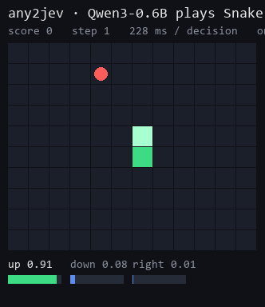

<div align="center">

# any2jev

**Turn any open model into a Jev-style System One decision model.**
One forward pass. Typed answers. Calibrated probabilities. No text generation.

[](https://github.com/any2jev/any2jev/actions)
[](https://pypi.org/project/any2jev/)
[](pyproject.toml)
[](LICENSE)

[中文文档](README_zh.md) · [How it works](docs/architecture.md) · [Data format](docs/data-format.md)

</div>

```
any2jev train --base Qwen/Qwen3-0.6B --data train.jsonl --val val.jsonl --out runs/my-jev
any2jev serve runs/my-jev            #  POST /v1/systemone, drop-in for the TypeSafe SDK
```

TypeSafe's [Jev](https://typesafe.ai) showed that a model which **decides** instead of **writes** is
40 to 200× faster and cheaper for routing, moderation, triage, ranking, guardrails and game agents.
Jev is closed. `any2jev` is the converter: point it at a Hugging Face checkpoint (Qwen, Llama, Gemma,
SmolLM, Phi, Mistral, ...) plus a few thousand labelled decisions, and get a model that answers
**Choice / Score / Noul** questions in one pass, with probabilities you can threshold.

## Why not just prompt an LLM for JSON?

| | LLM + JSON schema | zero-shot logit reading | **any2jev** |
|---|---|---|---|
| Latency | seconds (autoregressive) | one pass | **one pass, all questions at once** |
| Output | text to parse and validate | probabilities of label tokens | **typed answers, always valid** |
| Probabilities calibrated? | no ("90% sure" is just text) | no (base-model logits) | **trained + temperature scaled, ECE reported** |
| Many questions per state | N× the cost | N× the prefill | **state encoded once, questions isolated** |
| Works with any base model | yes | mostly | **yes, LoRA + a 0.5M-param head** |

## What you get

```
                 ┌─────────────────────── one forward pass ───────────────────────┐
  state ────────►│ <state> …  │ <q> which team? <opt>billing</opt><opt>shipping</opt> <decide> │──► {billing: 0.91, shipping: 0.09}, confidence 0.86
                 │            │ <q> urgent?     <opt>no</opt><opt>yes</opt>          <decide> │──► noul 0.97
                 │            │ <q> how angry?  <opt>calm</opt> … <opt>furious</opt> <decide> │──► score 1.4, {0: .05, 1: .5, 2: .45}
                 └─────────────── questions see the state, never each other ─────────────────┘
```

* **Model surgery** — the vocabulary head is dropped; a pointer head scores each option's hidden state
  against a decision token. Works on any `AutoModelForCausalLM`; hybrid backbones (Qwen3.5) fall back
  to one causal row per question.
* **Block-causal packing** — the state is encoded once; every question attends to it and to itself
  only, so answers never depend on sibling questions (verified by a test, not a promise).
* **Training** — LoRA + head + delimiter embeddings, cross-entropy plus optional Brier / ordinal terms,
  option shuffling for order robustness, then **temperature scaling** on held-out data.
* **Evaluation that matches the claims** — accuracy, NLL, Brier, ECE, AURC and coverage-at-risk per
  question type, an option-order sensitivity test and a packed-vs-separate isolation check.
* **Jev-compatible server** — `POST /v1/systemone` and `GET /v1/models` with TypeSafe's exact wire
  format. The official `typesafe-sdk` runs against it with only `base_url` changed.

## Quick start

```bash
pip install any2jev[serve]              # + [data] for public datasets, [compat] for the TypeSafe SDK

# 1. data: 2,000 synthetic support tickets (no download), or convert public datasets
any2jev data synthetic --out data/synthetic --n 2000
any2jev data build --sources boolq,ag_news,banking77,sst5 --out data/public --n-per-source 1500

# 2. train: surgery + LoRA + head + temperature scaling in one command
#    (Qwen3-0.6B on one 8 GB GPU: 7 min for 2k short tickets, ~55 min for 5.4k public records)
any2jev train --base Qwen/Qwen3-0.6B --data data/public/train.jsonl --val data/public/val.jsonl --out runs/qwen3-0.6b

# 3. evaluate: calibration, order sensitivity, isolation
any2jev eval runs/qwen3-0.6b --data data/public/test.jsonl

# 4. ask, or serve
any2jev ask runs/qwen3-0.6b --state "My payouts have failed 3 days in a row, fix this ASAP" \
    --choice "Which team? | billing, technical, sales" --noul "Is this urgent?" \
    --score "How frustrated? | calm, frustrated, furious"
any2jev serve runs/qwen3-0.6b --port 8009
```

Then, with the official SDK:

```python
from typesafe_sdk import Choice, Noul, Score, TypeSafeClient

client = TypeSafeClient(api_key="local", base_url="http://127.0.0.1:8009", model="any2jev-latest")
r = client.system_one(
    state="Shoes arrived two weeks late and in the wrong size. Also I see two charges on my card.",
    questions={
        "department": Choice(instructions="Which team should handle this?",
                             criteria={"returns": "Exchanges, refunds, wrong or damaged items",
                                       "shipping": "Delivery status, delays, lost packages",
                                       "billing": "Charges, invoices, payment problems"}),
        "escalate": Noul(instructions="Does this need urgent human attention?"),
        "frustration": Score(instructions="How frustrated is the customer?", criteria=["Calm", "Frustrated", "Very angry"]),
    })
r.choices["department"].probabilities   # {'returns': 0.47, 'shipping': 0.28, 'billing': 0.25}
r.nouls["escalate"].noul                # 0.93
r.scores["frustration"].score           # 1.44
```

Or raw HTTP, identical to Jev's contract:

```bash
curl -s localhost:8009/v1/systemone -H 'content-type: application/json' -d @examples/request.json
```

## Results

Qwen3-0.6B, LoRA r=16, one epoch, one RTX 2060 SUPER (8 GB). Held-out test splits, temperature fitted
on validation. `any2jev eval` prints these tables; the JSON reports are in `runs/`.

<!-- RESULTS:PUBLIC -->
| question type | n | system | acc | NLL | Brier | ECE | AURC | cov@5% |
|---|---|---|---|---|---|---|---|---|
| overall | 1000 | zero-shot logits (base) | 0.531 | 1.180 | 0.595 | 0.111 | 0.276 | 0.05 |
| overall | 1000 | zero-shot + temperature | 0.531 | 1.125 | 0.579 | 0.058 | 0.279 | 0.05 |
| overall | 1000 | **any2jev** | **0.796** | **0.506** | **0.284** | **0.027** | **0.062** | **0.57** |
| noul | 250 | zero-shot logits (base) | 0.644 | 0.693 | 0.479 | 0.166 | 0.216 | 0.12 |
| noul | 250 | zero-shot + temperature | 0.644 | 0.631 | 0.443 | 0.119 | 0.216 | 0.12 |
| noul | 250 | **any2jev** | **0.844** | **0.386** | **0.242** | **0.090** | **0.058** | **0.58** |
| choice | 500 | zero-shot logits (base) | 0.622 | 1.163 | 0.534 | 0.082 | 0.222 | 0.09 |
| choice | 500 | zero-shot + temperature | 0.622 | 1.118 | 0.532 | 0.087 | 0.226 | 0.09 |
| choice | 500 | **any2jev** | **0.906** | **0.272** | **0.142** | **0.020** | **0.018** | **0.88** |
| score | 250 | zero-shot logits (base) | 0.236 | 1.700 | 0.835 | 0.145 | 0.710 | 0.00 |
| score | 250 | zero-shot + temperature | 0.236 | 1.634 | 0.811 | 0.092 | 0.705 | 0.00 |
| score | 250 | **any2jev** | **0.528** | **1.093** | **0.611** | **0.056** | **0.424** | **0.01** |

Option-order test on 23 Choice questions: argmax stable in 96% of them, mean max probability spread 0.088.
Isolation check: packed vs. separate answers differ by at most 0.0e+00.
Temperature fitted on validation: T = 1.61. Test set: 1000 records, 1000 questions.
<!-- /RESULTS:PUBLIC -->

Synthetic support tickets (2,000 records, 4 question types, rule-based labels) are solved to
accuracy 1.000 / ECE 0.001 in 7 minutes; the option-order test is 100% stable and the isolation check
shows packed and separate answers agree to 1e-6. That run is the smoke test, not the benchmark.

Latency (steady state, single request, 3 questions, `examples/bench_latency.py`):

<!-- RESULTS:LATENCY -->
| base | dtype | device | input tokens | questions | p50 ms | p95 ms |
|---|---|---|---|---|---|---|
| Qwen/Qwen3-0.6B | float32 | cuda:0 | 116 | 3 | 41.8 | 53.2 |
| Qwen/Qwen3-0.6B | bfloat16 | cuda:0 | 116 | 3 | 61.6 | 64.2 |
| Qwen/Qwen3-0.6B | bfloat16 | cuda:0 | 353 | 12 | 133.4 | 136.8 |
| Qwen/Qwen3-0.6B | bfloat16 | cuda:0 | 361 | 3 | 132.8 | 133.7 |
<!-- /RESULTS:LATENCY -->

The GPU is an RTX 2060 SUPER (Turing), which has no native bf16, so fp32 is the faster dtype there;
on Ampere or newer bf16 wins. Latency grows with input tokens, not with the number of questions:
12 questions cost the same as 3 once the sequence length matches.

### Snake, one Choice per tick

`examples/snake.py` generates labelled moves from a BFS teacher, `any2jev train` turns Qwen3-0.6B into
the policy, and the game loop asks one Choice question per tick over the legal moves. No text is generated.

<!-- RESULTS:SNAKE -->


Held-out teacher moves: accuracy 0.953, ECE 0.034, 400 decisions.
Recorded game: final score 21 in 161 steps | median latency 41 ms
<!-- /RESULTS:SNAKE -->

## How it works

See [docs/architecture.md](docs/architecture.md). In short:

1. `extract_backbone()` keeps the decoder stack of a `*ForCausalLM` and discards `lm_head`.
2. Five delimiter tokens (`<state> <q> <opt> </opt> <decide>`) are reused from the tokenizer's spare
   specials or added. User text is sanitised so it can never forge one.
3. State + questions are packed into one sequence under a **block-causal mask**; branch positions
   restart after the state. Hybrid (linear-attention) backbones fall back to one causal row per question.
4. A **pointer head** scores `h(</opt>_k) · h(<decide>)`; softmax with a fitted temperature.
5. Noul, Choice and Score are all the same primitive with different option lists; `confidence` uses
   TypeSafe's published formulas.

## Which base model?

Anything `AutoModelForCausalLM` loads. Benchmarked so far: Qwen3-0.6B (attention-only, packed mode).
Hybrid backbones with linear-attention layers (Qwen3.5) take the rows-mode fallback; that code path is
unit-tested, a hybrid benchmark is pending. Delimiter reuse is built in for Qwen, Llama 3 and Gemma
tokenizers; other tokenizers get five new tokens. Rough VRAM for fp32 LoRA training with 384-token
states: 0.6B → 8 GB, 1.7B → 16 GB (use `--dtype bf16` to halve it).

## Roadmap

- [ ] RLCR-style RL stage (`correct − (confidence − correct)²` reward) on top of the supervised recipe
- [ ] State-prefix KV cache in the server (exact, thanks to the block-causal mask)
- [ ] vLLM / SGLang backend for large bases; ONNX export for the small ones
- [ ] Encoder backbones (ModernBERT) through the same interface
- [ ] Pretrained adapters on the Hub for Qwen3 0.6B / 1.7B / 4B

## Related work

Jev is [TypeSafe AI](https://typesafe.ai)'s model; this project is independent and not affiliated.
The packed-question architecture follows Archer Hume's
[*Jev's Architecture Unmasked*](https://archerhume.com/posts/jevs-architecture-unmasked) and the
[kev](https://github.com/jaredpalmer/kev) reproduction (Apache-2.0), which trains a fixed Qwen family;
`any2jev` generalises the recipe into a converter for arbitrary bases with an evaluation and calibration
toolkit. [rlcd-lite](https://github.com/arnabgho/rlcd-lite) informed the calibration objective.
[awesome-jev](https://github.com/OmniJev/awesome-jev) lists the wider ecosystem.

## License

Apache-2.0.
